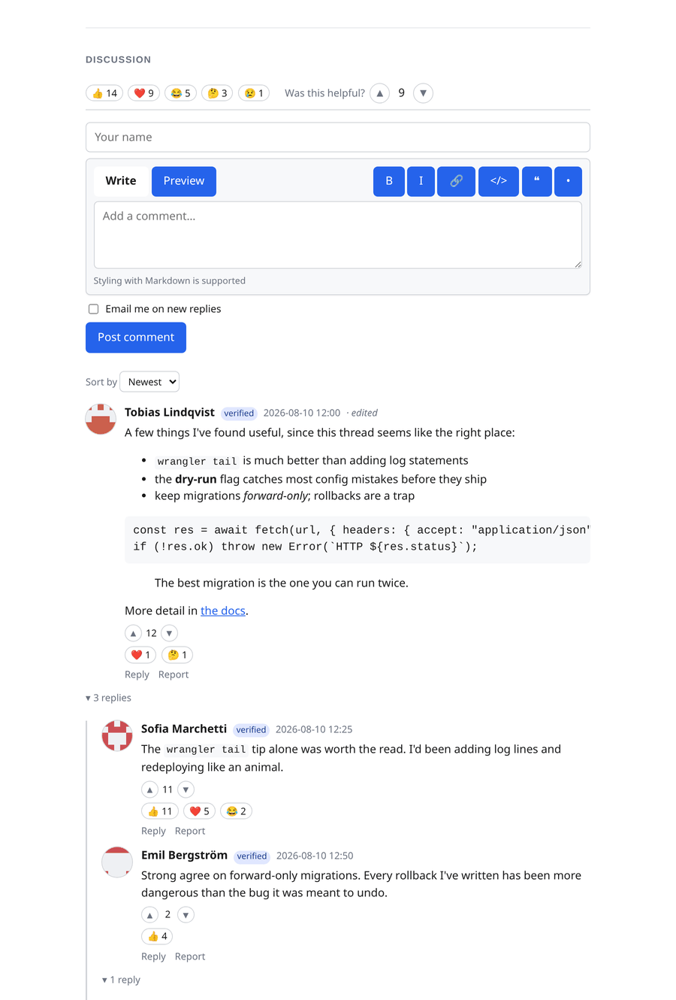
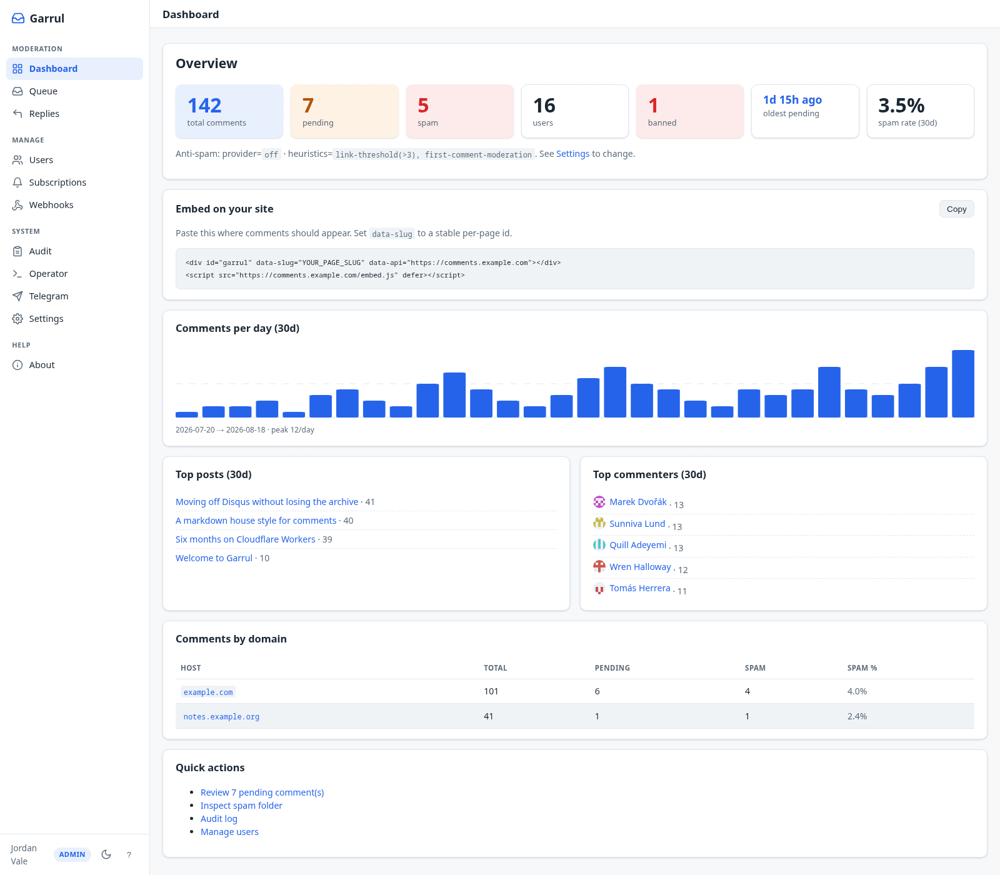
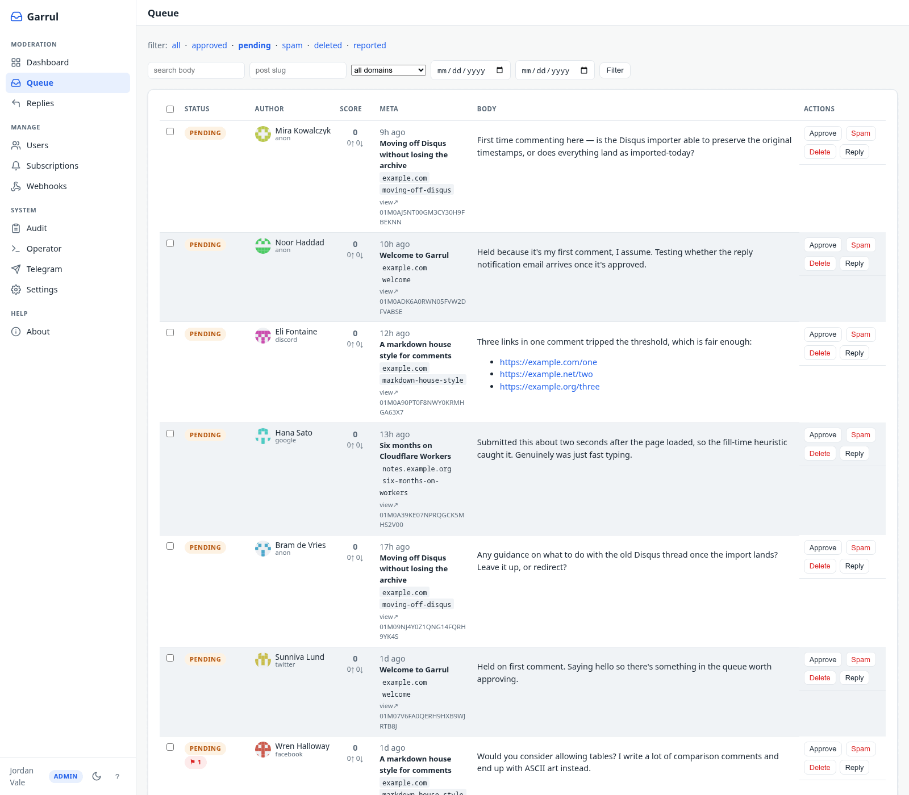

# Garrul

[](https://github.com/sponsors/KingPin)
[](https://ko-fi.com/kingpinx)
[](LICENSE)

Self-hosted comments for static sites and blogs. Runs on Cloudflare
Workers + D1 + KV + Turnstile. One Worker per site, no per-comment
billing, your data stays in your account.

**[Try the live demo →](https://comments.garrul.com)**

Self-hosted, but not the hard kind: **there is no container, no VPS, and
no database server**. Nothing to patch, no uptime to monitor, no TLS to
renew, and Cloudflare keeps point-in-time backups of D1 for you. It is
one Worker, and keeping it current is a single dry-runnable command per
release. Two credentials to get started (a Turnstile key pair, from one
dashboard page); every other integration is optional.

- **Threaded comments**: markdown, reactions, an edit/delete window, and
  a newest/oldest/top sort readers can switch
- **OAuth sign-in** (GitHub, Google, Facebook, X, Discord) plus anonymous
  posting, rate-limited and Turnstile-gated
- **Embeddable widget**: CI-capped at 30 KB gzipped, Shadow-DOM isolated,
  themeable, with an iframe alternative
- **Reply notifications by email**, built in: readers opt in from the
  widget, confirm by double opt-in, get a debounced digest, and leave in
  one click from Gmail's own Unsubscribe button. Bring a Resend key
  ([`docs/notifications.md`](docs/notifications.md))
- **Moderator notifications by email**: a digest of what's queued or
  reported. Off by default; one switch in *Settings → Moderation*
- **Layered anti-spam**: Turnstile, rate limiting and a strict markdown
  sanitizer always on, four tunable heuristics and an optional classifier
  on top, everything routed to the queue
  ([`docs/ANTISPAM.md`](docs/ANTISPAM.md))
- **Import from Disqus, Remark42, Comentario or isso**: upload the export in
  the admin UI — the `.xml.gz` Disqus hands you, the `userbackup-<site>-<ts>.gz`
  Remark42 writes nightly, or Comentario's JSON export, no unzipping — or run
  `npm run import-disqus -- ./export.xml.gz --dry-run` /
  `npm run import-remark42 -- ./userbackup.gz --dry-run` /
  `npm run import-comentario -- ./export.json --dry-run` first. The Comentario
  reader also takes a legacy Commento export. isso ships no export at all, so
  it's two steps — `npm run dump-isso -- ./comments.db --out dump.json` to
  read its SQLite store, then either `npm run import-isso -- ./dump.json
  --dry-run` or upload that same `dump.json` on the admin UI same as the
  other three sources (see [`docs/importing.md`](docs/importing.md)).
  Idempotent, so a re-run inserts nothing; closed threads stay closed and
  spam stays out of the public tree
- **Admin UI**: moderation queue, user management, and settings you
  change without a redeploy
- **RSS feeds**, comment counts, permalinks
- **Webhook out** on every comment event: generic, Slack, Discord, or
  Telegram
- **Telegram operator bot**: moderate from your phone with inline
  buttons, `/queue` and `/stats`, optional daily digest

Every doc in the repo, grouped by task:
[`docs/README.md`](docs/README.md).

## Screenshots

What your readers see, rendered inside a Shadow DOM so the host page's CSS
can't collide with it:



The admin dashboard, with counts at a glance, your embed snippet ready to
copy, and 30-day comment volume:



The moderation queue, where comments are approved, marked spam or deleted
inline:



More, including dark mode, mobile, and the rest of the admin UI:
[`docs/screenshots.md`](docs/screenshots.md).

## Install

Deploying to production takes ~20 minutes the first time, and then
`npm run upgrade` per release: one command with a `--dry-run` that prints
its plan before touching anything. That is the whole maintenance story;
there is no OS to patch and no service to restart.

The step-by-step guide covers prerequisites, OAuth setup, Turnstile,
custom domain, remote migrations, deploy and smoke test:
[`INSTALL.md`](INSTALL.md). Upgrades are in
[`INSTALL.md#updating`](INSTALL.md#updating).

**Want to try it first? No Cloudflare account needed.**
`.dev.vars.example` ships working dev defaults, including Cloudflare's
"always passes" Turnstile test keys, so this runs with zero edits and
zero credentials:

```bash
git clone https://github.com/KingPin/Garrul.git comments
cd comments
npm install
cp wrangler.example.toml wrangler.toml
cp .dev.vars.example .dev.vars
npm run migrate           # local Miniflare DB
npm run dev               # http://localhost:8787
```

## Embedding

Drop the widget into any page:

```html
<div
  id="garrul"
  data-slug="my-post-slug"
  data-api="https://comments.example.com"
  data-title="My post title"
  data-url="https://example.com/my-post/"
></div>
<script src="https://comments.example.com/embed.js" defer></script>
```

Copy-paste recipes for Astro, Hugo, Jekyll, WordPress, plain HTML and the
iframe variant, plus what each attribute does:
[`examples/README.md`](examples/README.md).

Host Content-Security-Policy, the iframe fallback, `data-lang`,
lazy-loading to cut the two mount requests bouncers cost you, and pointing
an AI assistant at your instance:
[`docs/embedding.md`](docs/embedding.md).

## Running it

- **Theming**: the widget mounts in Shadow DOM, so host-page CSS doesn't
  leak in. Restyle by overriding CSS custom properties on the host
  element; those names are part of the public, semver-protected API
  ([`docs/THEMING.md`](docs/THEMING.md)).
- **Admin UI**: `/admin`, for an OAuth sign-in whose email is in
  `ADMIN_EMAILS`.
- **Logs**: `wrangler tail`. Every request emits a JSON line with a
  request id. No PII (names, emails, comment bodies) is logged.
- **Metrics**: Workers Analytics Engine writes `comment.posted`,
  `oauth.complete`, `ratelimit.hit` and friends; read them in the
  Cloudflare dashboard under your Worker.
- **Backups**: `npm run db:export` writes a `.sql` dump for your local
  archive. Cloudflare keeps point-in-time backups of D1 as well.
- **Re-render**: bumped the markdown sanitizer? `npm run rerender`
  rewrites stored comment HTML in place.

Day-to-day operation in full: [`AGENTS-OPERATE.md`](AGENTS-OPERATE.md).

## Anti-spam

Always on, with no configuration at all: a sliding-window rate limit on
the edge Cache API, a strict markdown sanitizer (no raw HTML, no images,
every link `nofollow ugc noopener`), and a hidden-field honeypot.
Turnstile covers anonymous posts once the Turnstile keys are set, and
`TURNSTILE_ALWAYS` challenges signed-in authors too.

On top of those, four heuristics: minimum fill time, link count, hold an
author's first comment, and a **muted-words list** with word-boundary and
wildcard terms. All off by default, each with an env var that sets the
deploy-time default, and all four retunable from **Settings → Moderation**
without a redeploy. Optionally a content classifier (Akismet or Workers
AI) runs when no heuristic has already flagged.

**Nothing is ever silently dropped.** Every layer routes to
`/admin/queue?status=pending`; you decide what gets approved. The
muted-words grammar, the env var behind each heuristic, and the Turnstile
mount timing with its four visitor-facing messages:
[`docs/ANTISPAM.md`](docs/ANTISPAM.md).

## Access control

Your instance is gated by `ALLOWED_ORIGINS` (set in `wrangler.toml`,
comma-separated, no wildcards). Every request under `/api/*`, including
plain GET reads of comment trees, counts, and config, must carry a
matching `Origin` header. Browser fetches from your own sites send it
automatically; direct curl or scraper hits return
`403 err.origin.forbidden`. Uptime probes, the OAuth callbacks, the Atom
feed, permalinks and `embed.js` are reachable without one.

The matching rules, the full exemption list, a curl test recipe, and what
a build-time fetcher should read instead:
[`AGENTS-OPERATE.md`](AGENTS-OPERATE.md#6-allowed_origins-deep-dive).

If you set a vulnerability-disclosure contact (Admin → Settings, or the
`SECURITY_CONTACT` var), your instance publishes it at
`/.well-known/security.txt` ([RFC 9116](https://www.rfc-editor.org/rfc/rfc9116)) —
the standard place security researchers look for where to report a
problem. Until then the route answers 404.

## Privacy

Garrul stores:

- Comment bodies + author names
- Email addresses (OAuth users, and subscribers who opted in to digests)
- HMAC-SHA-256 hashed IP addresses (never the raw IP) and user-agent strings
- Provider IDs and avatar URLs for OAuth users

No analytics, no tracking pixels, no advertising, no Gravatar. One
strictly-necessary cookie. Data-subject requests are served by a per-user
JSON export and an admin erase panel, both on `/admin/users/<id>`.

Running an instance that European or Californian readers comment on makes
**you** the controller of that data, not this project.
`docs/privacy-policy.template.md` and `docs/tos.template.md` are yours to
fill in and link from your footer, and
[`docs/compliance/`](docs/compliance/) has the paperwork that follows: a
personal-data inventory, the data-subject rights mapped to the mechanisms
that serve them, CCPA/CPRA categories, a subprocessor register, and a DSAR
runbook. Not legal advice, and it does not claim Garrul "is GDPR
compliant": compliance is a property of a deployment.

## Troubleshooting

[`docs/troubleshooting.md`](docs/troubleshooting.md) is symptom-by-symptom
across setup, embedding, OAuth, cookies and sessions, notification email,
and performance. The two that bite most often: Safari readers can't sign
in unless you serve over HTTPS, because cookies are
`SameSite=None; Secure; Partitioned`; and `*.workers.dev` shouldn't be
used in production, so map a custom subdomain.

## Contributing

Bug reports and PRs welcome. See
[`CONTRIBUTING.md`](CONTRIBUTING.md). Project conventions and code
layout are documented in [`CLAUDE.md`](CLAUDE.md).

## License

Apache 2.0. See [`LICENSE`](LICENSE) and [`NOTICE`](NOTICE).
