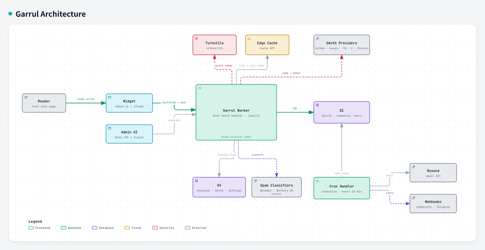

# Architecture

<picture>
  <source media="(prefers-color-scheme: dark)" srcset="screenshots/architecture-dark.webp">
  
</picture>

Drawn from commit `ef5d37b` (v2.32.0). If the code and the diagram disagree,
the code wins.

## Runs in your Cloudflare account

| Component | What it does | Read more |
| --- | --- | --- |
| Garrul Worker | One Hono app: `/embed.js`, the iframe embed, `/api/v1/*`, `/admin`, `/telegram`, feeds. Every state-changing request passes the `ALLOWED_ORIGINS` check. | [`../CLAUDE.md`](../CLAUDE.md) |
| Cron handler | The same Worker's `scheduled` export, every 15 minutes: reply digests, moderator mail, webhook retries, Telegram digest, retention pruning. | [`notifications.md`](notifications.md) |
| D1 | Comments, users, posts, settings overrides, the notification and webhook-retry queues. | [`compliance/data-inventory.md`](compliance/data-inventory.md) |
| KV | Sessions, OAuth state, resolved settings. Writes are kept off the per-request path (sessions refresh on an interval, not on every hit): the free tier allows 1000 writes a day account-wide. | [`../AGENTS-OPERATE.md`](../AGENTS-OPERATE.md) |
| Edge cache | The Cache API: first page of each comment tree, and rate-limit counters. A new comment busts its tree entry. | — |

## Outside services

| Service | When it is called | Read more |
| --- | --- | --- |
| Turnstile | On comment post, to verify the reader's challenge token. | [`ANTISPAM.md`](ANTISPAM.md) |
| OAuth providers | On sign-in: GitHub, Google, Facebook, X, Discord — whichever you configure. | [`../INSTALL.md`](../INSTALL.md) |
| Akismet, Workers AI | Only when configured, to classify a new comment. | [`ANTISPAM.md`](ANTISPAM.md) |
| Resend | From the cron pass, for reply and moderator email. | [`notifications.md`](notifications.md) |
| Webhook endpoints, Telegram | On new comments, with retries from the cron pass. The Telegram bot also sends updates *to* the Worker on `/telegram`. | [`webhooks.md`](webhooks.md), [`telegram.md`](telegram.md) |

Which of these receive personal data, and when:
[`compliance/subprocessors.md`](compliance/subprocessors.md).
