# Screenshots

A visual tour of the reader-facing widget and the admin UI.

> Screenshots reflect **v2.5.1** and may lag the current UI. They are
> regenerated from seeded demo data, not from a live instance — every name,
> avatar, comment, email address and webhook URL below is invented.

## The widget

What your readers see. The widget renders inside a Shadow DOM, so the host
page's CSS can't leak in and Garrul's can't leak out. Colors come from CSS
variables — see [`THEMING.md`](THEMING.md).

### Light

### Dark

Follows the host page's `prefers-color-scheme` by default, or force it with
`data-theme`.

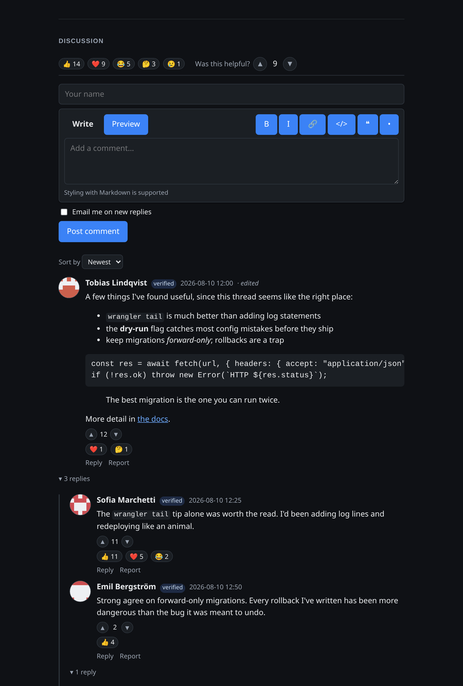

### Mobile

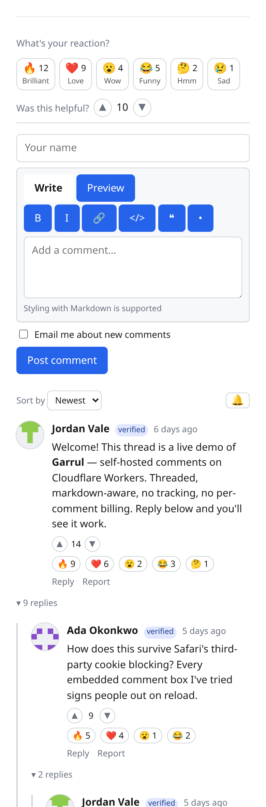

Long lines in fenced code blocks scroll inside the block rather than widening
the host page.

## Admin UI

Server-rendered HTML with Alpine.js for interactivity — no SPA bundle. Reachable
at `/admin` for signed-in users listed in `ADMIN_EMAILS`.

### Dashboard

Counts at a glance, your embed snippet ready to copy, and a 30-day comment
volume chart.

### Moderation queue

The default view is everything awaiting a decision. Approve, spam, or delete
inline; filter by status or host.

Switch to approved comments to browse or retro-moderate published threads:

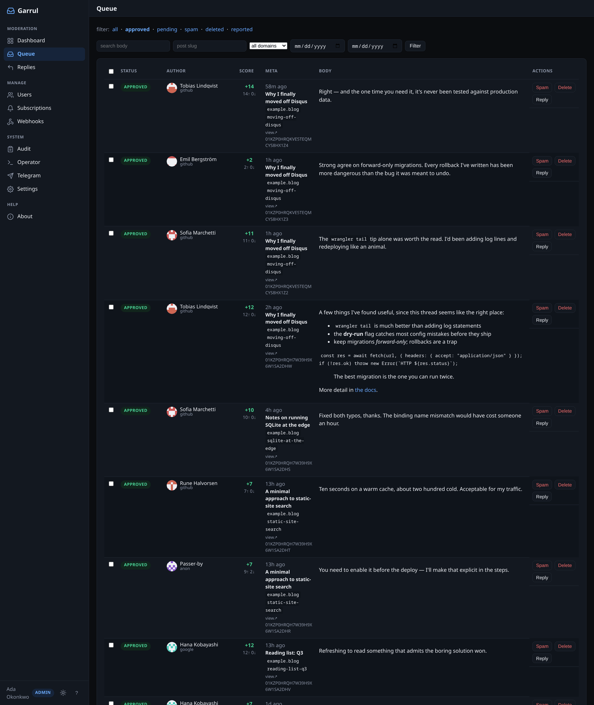

What the spam filter caught, so you can spot false positives:

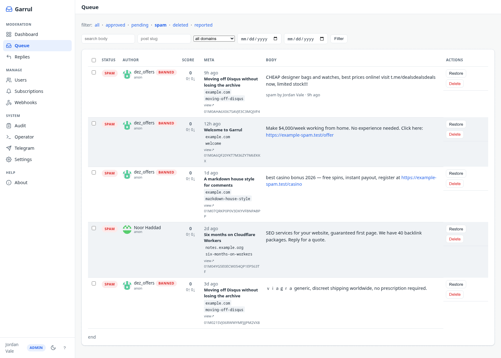

Reader reports cut across statuses — a reported comment may already be
approved:

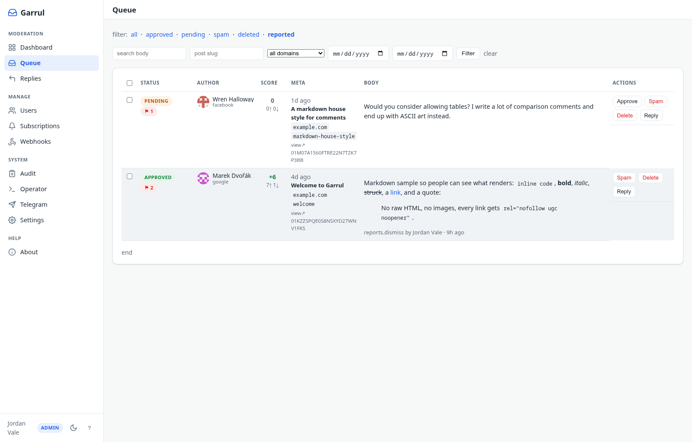

### Comment detail

Full context for one comment: the rendered body and its raw markdown, the reader
reports against it, its replies, and the author's five most recent other
comments — enough to judge a report without leaving the page. Actions run from
spam/delete through to banning the author or dismissing the reports.

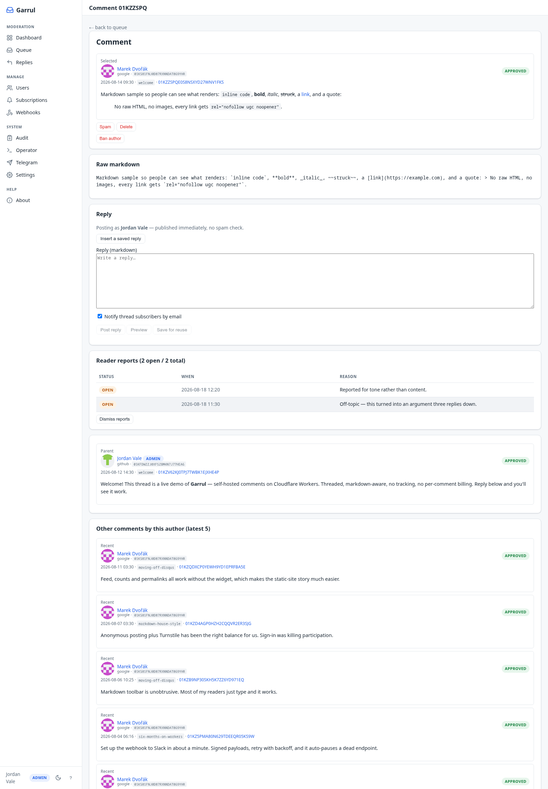

### Users

Everyone who has commented, with their provider, comment count, and ban
controls.

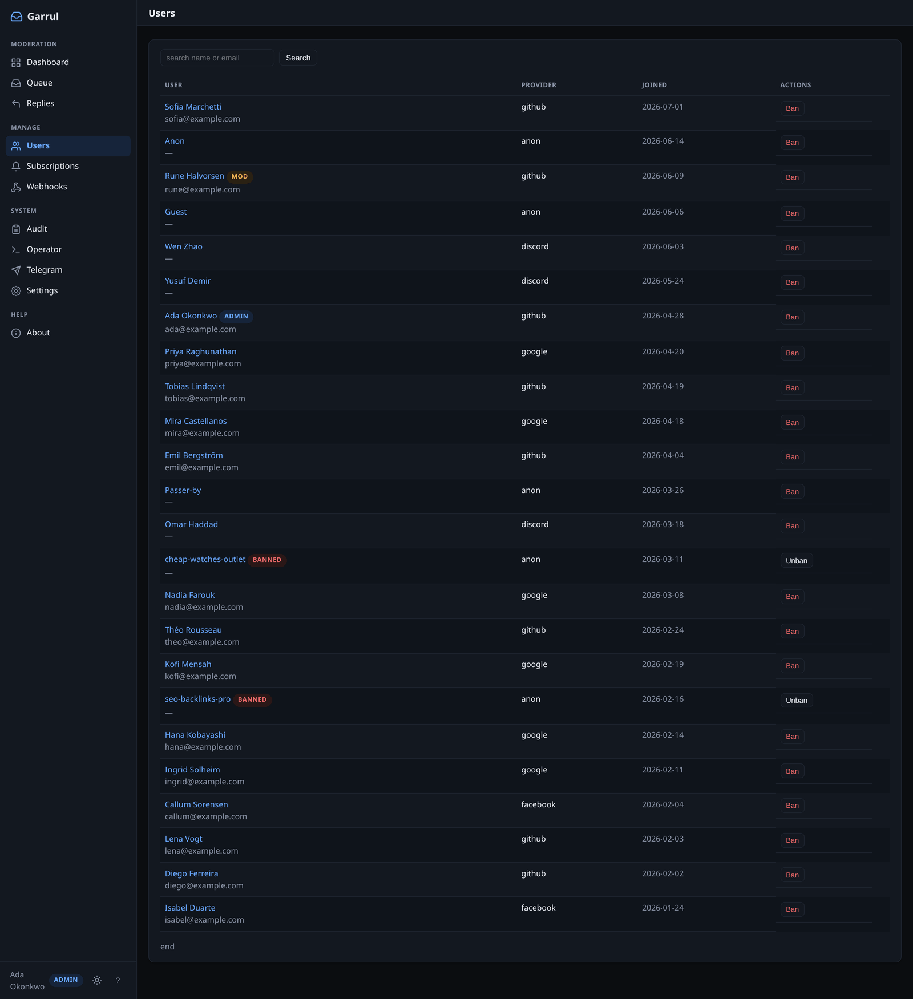

### Audit log

Every moderation action, who performed it, and when. Append-only.

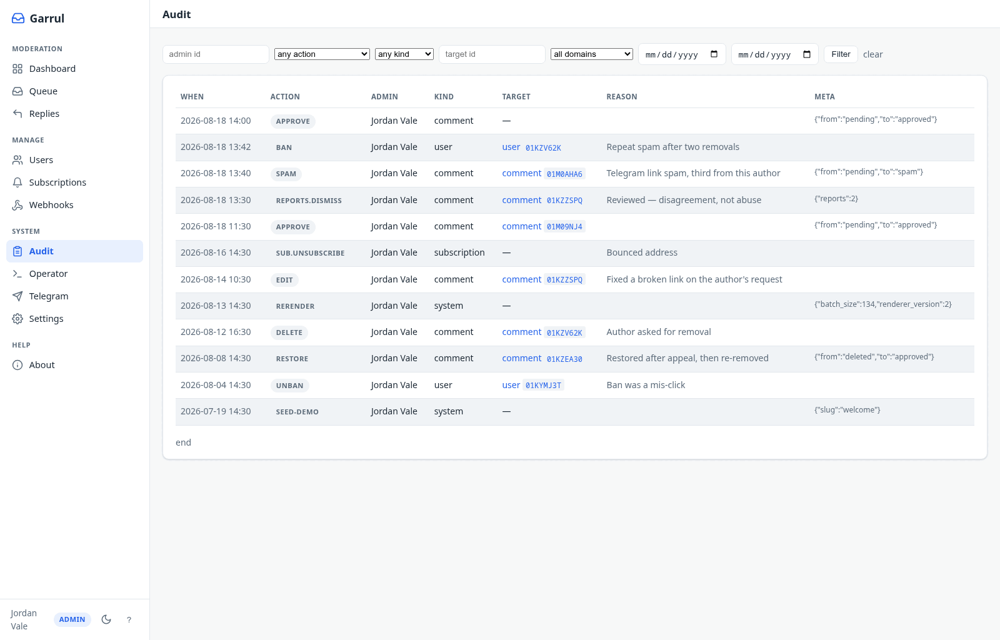

### Settings

Feature toggles, display options and moderation rules, resolved from defaults +
KV overrides. A toggle here overrides the matching env var without a redeploy;
"Reset to defaults" clears the overrides again. Grouped into tabs — the Features
tab is shown here.

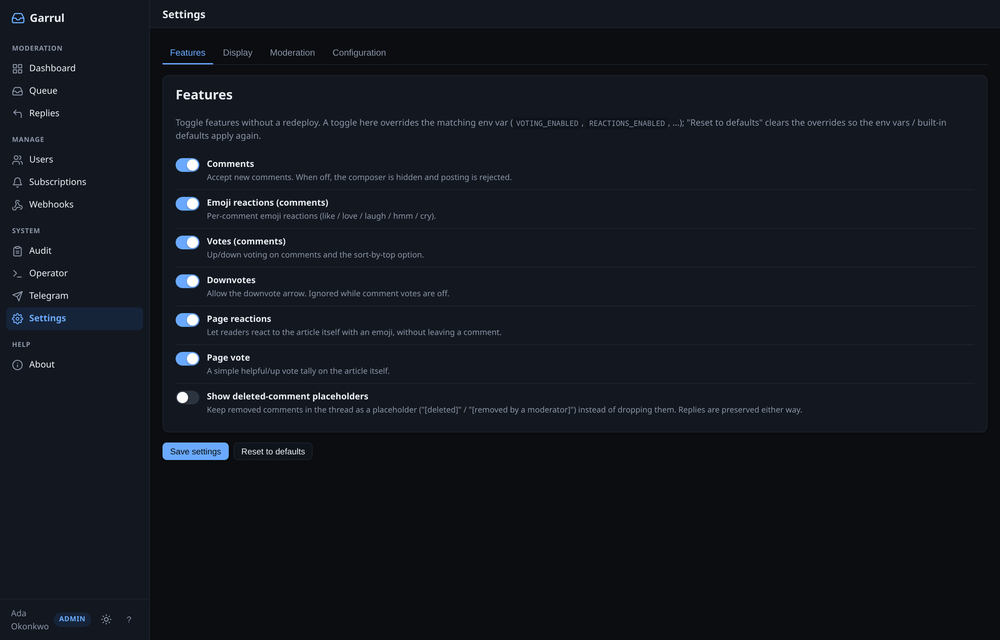

### Webhooks

Outbound endpoints, the events each subscribes to, and their delivery health.
Failed deliveries retry with exponential backoff for ~9 hours; an endpoint that
gives up 10 in a row is auto-paused, as the middle row shows. See
[`webhooks.md`](webhooks.md).

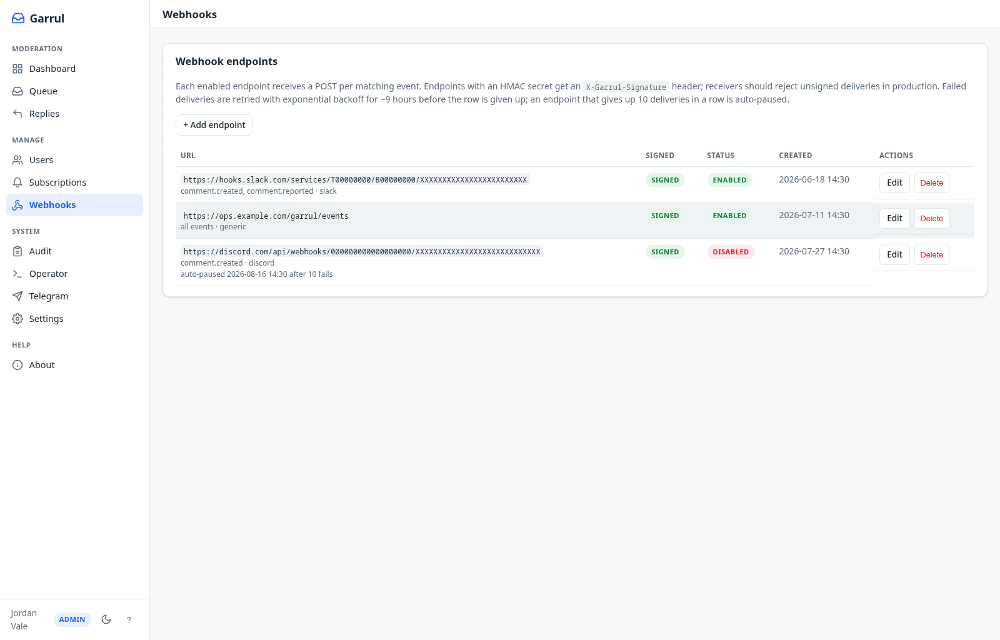

### Saved replies

Canned moderator responses, insertable when replying from the queue.

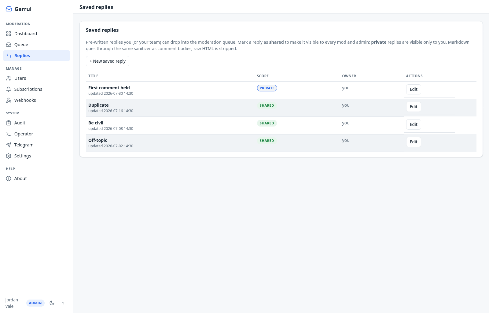

### Subscriptions

Who is subscribed to replies on which post, and whether they've confirmed.

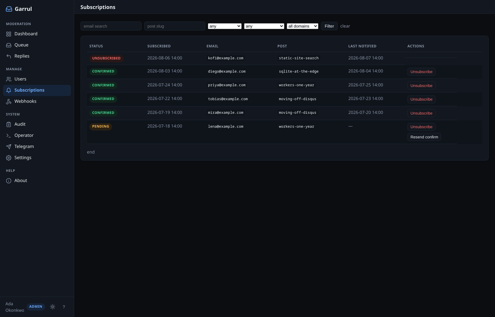

### Operator

One-off maintenance jobs: re-render stored comment HTML after a sanitizer
change, inspect IP-hash retention, seed a demo post, and import a Disqus export.
Each panel reports current state first — here, all 134 comments are already at
renderer version 2, so the rerender is a no-op.

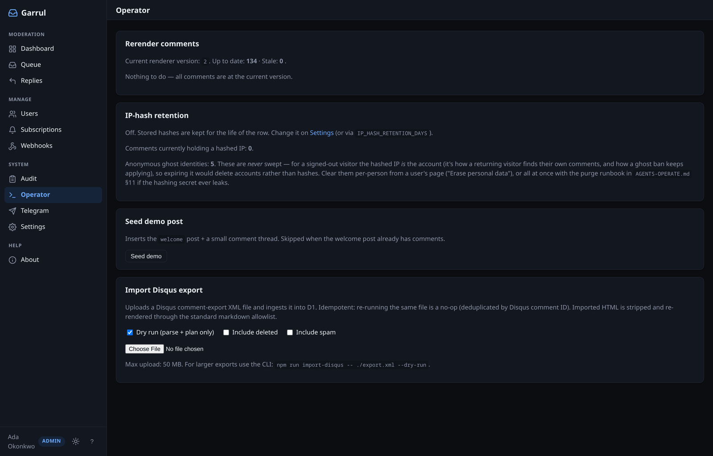

## Regenerating these

There's no committed harness for this — the screenshots are produced ad hoc
against a local `wrangler dev` instance seeded with invented data, then
downscaled to 1× and quantized to a 256-colour palette to keep the repo light.

Two things to preserve if you reshoot them:

- **Never capture Settings → Configuration.** That tab renders live env values
  (`ALLOWED_ORIGINS`, `ADMIN_EMAILS`, and similar). Only the Features tab is
  safe to publish.
- **Use seeded data, never a real instance.** Blurring production screenshots
  is not a substitute; a blur that misses one character leaks a live secret.
